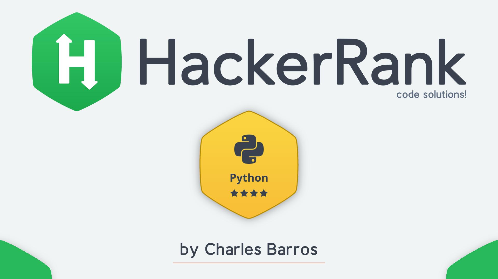

    

<h1 align='center'>Python Challenges</h1>

    <h3>
      <a href='https://www.hackerrank.com/domains/python?badge_type=python' target="_blank"> HackerRank Platform</a>
    </h3>

## <strong>The Challenge</strong>
This is a series of 114 Python Challenges, covering all the main aspects of the Python Programming Language.

## <strong>Important</strong>

All codes were written in Python 3 and validated on the HackerRank platform to obtain points for the Challenge. They were also tested locally using VS Code with the Official Microsoft Python extension and adjusted to work locally when necessary.
Codes that require a module or any other resource that is not standard in the Python language are specified in comments in the script itself.

## <strong>Challenges and Solutions</strong>
> **To see my solutions, check out the folder** [**python-scripts**](./python-scripts/)

- [001 - Say "Hello, World!" With Python](https://www.hackerrank.com/challenges/py-hello-world/problem?isFullScreen=true)
- [002 - Python If-Else](https://www.hackerrank.com/challenges/py-if-else/problem?isFullScreen=true)

- ...

- The rest of the challenges are still under development ... 

## <strong>Acknowledgments</strong>
I would like to thank the entire [HackerRank](https://www.hackerrank.com/) platform team for the excellent content made available.

